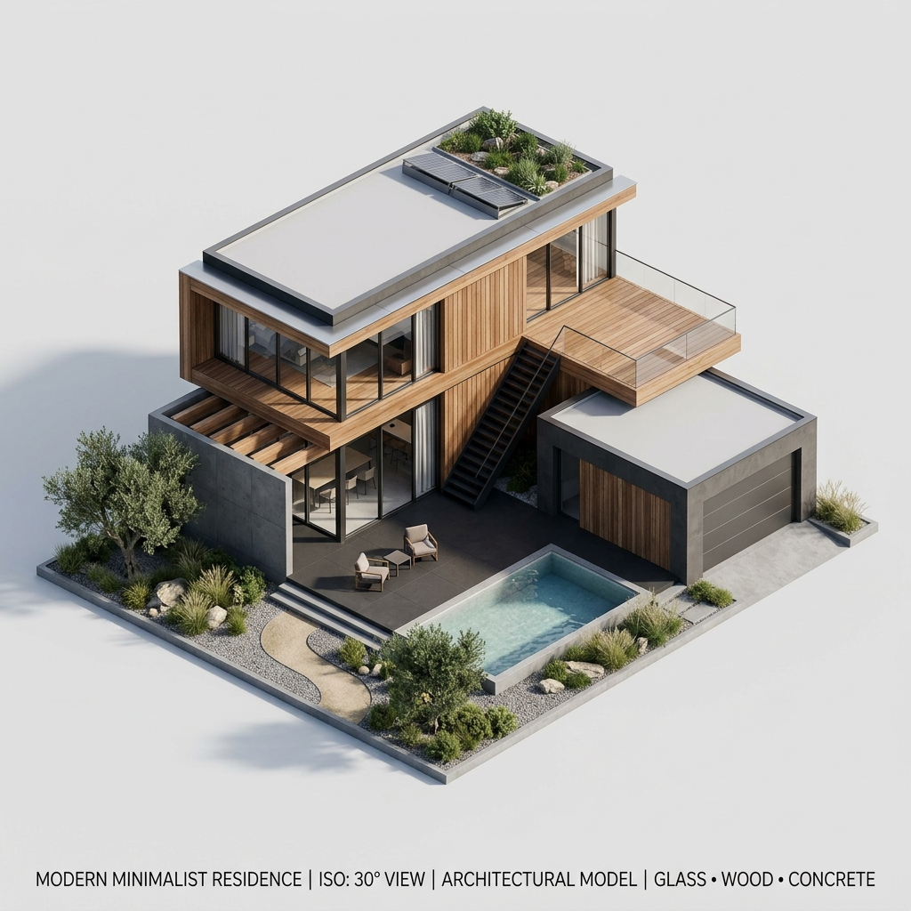
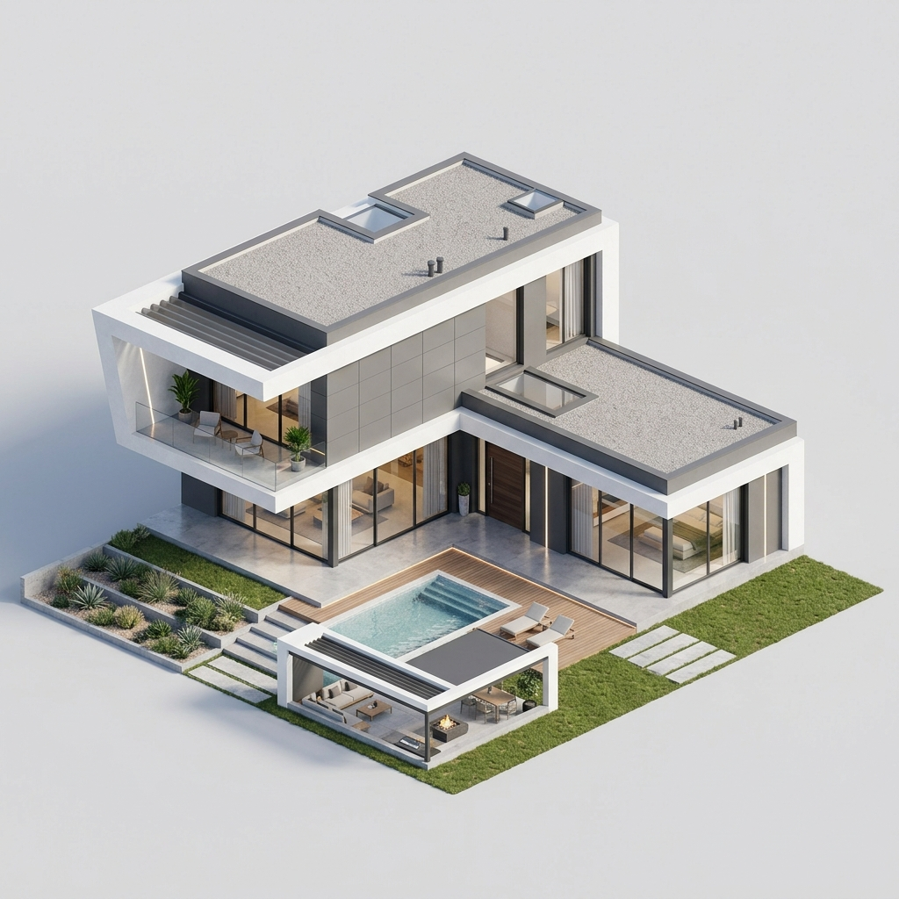

# Comprehensive One-Shot Prompt for Premium Real Estate Website (JAFFA GROUP)

You are an expert Frontend Developer and UI/UX Designer. Your task is to build a high-end, cinematic, and premium real estate website called "JAFFA GROUP". The website features a "Quiet Luxury" black-and-white aesthetic with a premium yellow accent (`#e6b905`), subtle GSAP animations, a scroll-triggered hero canvas sequence, and modern typography.

Please create the following three files exactly as provided below: `index.html`, `style.css`, and `main.js`. 

## Dependencies and Assets
The site uses the following external libraries which are already included via CDN in the HTML:
- Fonts: Google Fonts (Inter and Outfit)
- Icons: FontAwesome 6.4.0
- Animations & Scroll: GSAP 3.12.2, ScrollTrigger 3.12.2, Lenis 1.0.42, AOS 2.3.1

### Local Assets Needed 
(If you are an AI generating this, mock these assets or assume they exist in the root folder):
- **Hero Canvas Images**: `ezgif-2408ce3314ae05eb-jpg/ezgif-frame-001.jpg` to `ezgif-frame-244.jpg`
- **Showcase & Catalog Images**: `showcase 2.webp`, `showcase 3.webp`, `showcase 4 .webp`, `showcase 5.webp`, `showcase6.webp`, `showcase 7.webp`, `T 2.webp`
- **3D House Models**: `house_model_1.png`, `house_model_2.png`

---

## 1. `index.html`

```html
<!DOCTYPE html>
<html lang="en">
<head>
    <meta charset="UTF-8">
    <meta name="viewport" content="width=device-width, initial-scale=1.0">
    <title>JAFFA GROUP | Premium Real Estate</title>
    <meta name="description" content="JAFFA GROUP - Designing architecture for life. Premium real estate and architectural design.">
    
    <!-- Google Fonts -->
    <link rel="preconnect" href="https://fonts.googleapis.com">
    <link rel="preconnect" href="https://fonts.gstatic.com" crossorigin>
    <link href="https://fonts.googleapis.com/css2?family=Inter:wght@300;400;500;600&family=Outfit:wght@300;400;600;700&display=swap" rel="stylesheet">
    
    <!-- CSS -->
    <link rel="stylesheet" href="style.css">
    <link href="https://unpkg.com/aos@2.3.1/dist/aos.css" rel="stylesheet">
    <link rel="stylesheet" href="https://cdnjs.cloudflare.com/ajax/libs/font-awesome/6.4.0/css/all.min.css">
</head>
<body>
    <!-- Navigation -->
    <nav class="navbar">
        <div class="nav-container">
            <div class="logo">
                <span class="logo-text">JAFFA</span>
                <span class="logo-sub">GROUP</span>
            </div>
            <ul class="nav-links">
                <li><a href="#about">About</a></li>
                <li><a href="#portfolio">Portfolio</a></li>
                <li><a href="#projects">Projects</a></li>
                <li><a href="#contact">Contact</a></li>
            </ul>
            <div class="nav-cta">
                <a href="#" class="btn-primary">Download Price &darr;</a>
            </div>
        </div>
    </nav>

    <!-- New Scroll-Triggered Hero -->
    <section class="scroll-hero">
        <div class="scroll-hero-sticky">
            <canvas id="hero-canvas"></canvas>
            
            <div class="scroll-hero-content">
                <div class="hero-text-overlay">
                    <div class="hero-eyebrow">It's called</div>
                    <h1 class="brand-title">JAFFA GROUP</h1>
                    <p class="brand-subtitle">Designing architecture for life</p>
                </div>
            </div>
            
            <div class="scroll-indicator">
                <span>SCROLL TO EXPLORE</span>
                <div class="indicator-line"></div>
            </div>
        </div>
    </section>

    <!-- About Section -->
    <section class="about-section" id="about">
        <div class="about-container">
            <div class="about-top-left" data-aos="fade-right">
                <span class="section-number">01/</span>
                <span class="section-title">About us</span>
            </div>
            
            <div class="about-heading-right" data-aos="fade-up">
                <h2 class="hero-subheading">
                    Where <span class="highlight">architecture</span> <br> 
                    meets <span class="highlight">living</span>
                </h2>
            </div>
            
            <div class="about-bottom-left" data-aos="fade-up" data-aos-delay="200">
                <p class="about-desc">
                    We create residential projects where clean architecture meets quality of living.
                </p>
            </div>
            
            <div class="about-bottom-right" data-aos="fade-up" data-aos-delay="400">
                <a href="#" class="btn-more">More &rarr;</a>
            </div>
        </div>
    </section>

    <!-- Catalog Section -->
    <section class="catalog-section" id="catalog">
        <div class="catalog-container">
            <!-- Sidebar / Categories -->
            <div class="catalog-sidebar">
                <div class="sidebar-header">
                    <span class="section-number">02/</span>
                    <span class="section-title">Catalog</span>
                </div>
                
                <ul class="category-list">
                    <li class="active">Cottages</li>
                    <li>Townhouses</li>
                    <li>Settlements</li>
                    <li>Investing spaces</li>
                </ul>
            </div>

            <div class="catalog-content">
                <div class="catalog-header" data-aos="fade-up">
                    <h2 class="catalog-title">A space that feels <br> like <span class="black-bg">a home</span></h2>
                </div>

                <div class="catalog-gallery" data-aos="fade-up" data-aos-delay="200">
                    <div class="slider-wrapper">
                        <div class="slider-track" id="catalog-slider">
                            <div class="slide"></div>
                            <div class="slide"></div>
                            <div class="slide"></div>
                            <div class="slide"></div>
                        </div>
                    </div>
                </div>

                <div class="catalog-footer">
                    <p class="catalog-desc">
                        Each project balances architecture, function, and visual calm – designed to live in today and value tomorrow.
                    </p>
                    <div class="slider-nav">
                        <button class="nav-btn prev" id="catalog-prev">&larr;</button>
                        <button class="nav-btn next" id="catalog-next">&rarr;</button>
                    </div>
                </div>
            </div>
        </div>
    </section>

    <!-- Steps Section -->
    <section class="steps-section" id="steps">
        <div class="steps-container" data-aos="fade-up">
            <div class="steps-header">
                <div class="sidebar-header">
                    <span class="section-number">03/</span>
                    <span class="section-title">Steps</span>
                </div>
                <h2 class="steps-headline">
                    Create <span class="dim">your own</span> <br> 
                    house <span class="dim">right now</span>
                </h2>
            </div>

            <div class="steps-nav-bar">
                <div class="step-btn" data-step="Research">Research</div>
                <span class="step-arrow">&rsaquo;</span>
                <div class="step-btn" data-step="Concept">Concept</div>
                <span class="step-arrow">&rsaquo;</span>
                <div class="step-btn" data-step="Form">Form</div>
                <span class="step-arrow">&rsaquo;</span>
                <div class="step-btn active" data-step="Visuals">Visuals</div>
                <span class="step-arrow">&rsaquo;</span>
                <div class="step-btn" data-step="Completion">Completion</div>
            </div>

            <div class="steps-content-grid">
                <div class="steps-left">
                    <p class="steps-desc" id="step-description">
                        Visualization translates ideas into clear, realistic visuals. It helps to understand space, proportions, and atmosphere before implementation.
                    </p>
                </div>
                <div class="steps-right">
                    <div class="step-visual-card">
                        
                    </div>
                    <div class="step-visual-card">
                        
                    </div>
                </div>
            </div>
        </div>
    </section>

    <!-- Project Showcase Section -->
    <section class="showcase-section" id="portfolio">
        <div class="showcase-container">
            <div class="showcase-header">
                <div class="sidebar-header">
                    <span class="section-number">04/</span>
                    <span class="section-title">Showcase</span>
                </div>
                <h2 class="showcase-title"><span class="dim">Project</span> <br> Showcase</h2>
            </div>

            <div class="showcase-filters-container">
                <div class="filter-pills">
                    <button class="filter-pill active">Villas</button>
                    <button class="filter-pill">Commercial</button>
                    <button class="filter-pill">Sustainable</button>
                    <button class="filter-pill">Interior</button>
                </div>
            </div>

            <div class="showcase-grid">
                <!-- Card 1 -->
                <div class="showcase-card slide-left" data-category="Villas">
                    <div class="card-parallax-container">
                        
                    </div>
                    <div class="card-content">
                        <h3>Aura Villa - Malibu</h3>
                        <p>A minimalist retreat integrating passive cooling and local stone.</p>
                    </div>
                </div>

                <!-- Card 2 -->
                <div class="showcase-card slide-right" data-category="Commercial">
                    <div class="card-parallax-container">
                        
                    </div>
                    <div class="card-content">
                        <h3>Skyline Lofts - Zurich</h3>
                        <p>Award-winning sustainable urban living in the heart of Switzerland.</p>
                    </div>
                </div>

                <!-- Card 3 -->
                <div class="showcase-card slide-left" data-category="Villas">
                    <div class="card-parallax-container">
                        
                    </div>
                    <div class="card-content">
                        <h3>Ethereal Heights - London</h3>
                        <p>Modern architectural marvel overlooking the Thames.</p>
                    </div>
                </div>

                <!-- Card 4 -->
                <div class="showcase-card slide-right" data-category="Sustainable">
                    <div class="card-parallax-container">
                        
                    </div>
                    <div class="card-content">
                        <h3>Crystal Cove - Dubai</h3>
                        <p>Luxury seaside living with cutting-edge desalination technology.</p>
                    </div>
                </div>

                <!-- Card 5 -->
                <div class="showcase-card slide-left" data-category="Interior">
                    <div class="card-parallax-container">
                        
                    </div>
                    <div class="card-content">
                        <h3>Verdant Oasis - Singapore</h3>
                        <p>Biophilic design bringing nature into the workspace.</p>
                    </div>
                </div>

                <!-- Card 6 -->
                <div class="showcase-card slide-right" data-category="Villas">
                    <div class="card-parallax-container">
                        
                    </div>
                    <div class="card-content">
                        <h3>Stellar Ridge - Oslo</h3>
                        <p>High-altitude living with panoramic views of the fjords.</p>
                    </div>
                </div>

                <!-- Card 7 -->
                <div class="showcase-card slide-left" data-category="Commercial">
                    <div class="card-parallax-container">
                        
                    </div>
                    <div class="card-content">
                        <h3>Nova Terrace - Tokyo</h3>
                        <p>Future-proof commercial space with integrated smart systems.</p>
                    </div>
                </div>
            </div>

            <div class="showcase-footer">
                <a href="#" class="btn-portfolio">View our portfolio &rarr;</a>
            </div>
        </div>
    </section>

    <!-- Park City Luxury Section -->
    <section class="info-section-yellow" id="park-city">
        <div class="info-yellow-container">
            <div class="info-sidebar">
                <div class="sidebar-header">
                    <span class="section-number">05/</span>
                    <span class="section-title">Park City</span>
                </div>
            </div>

            <div class="info-content">
                <h2 class="info-headline" data-aos="fade-up">
                    Why Park City Is One of the Best <br> 
                    Places to Build a <strong>Luxury Home</strong>
                </h2>

                <div class="info-grid">
                    <div class="info-block" data-aos="fade-up" data-aos-delay="100">
                        <span class="block-number">01</span>
                        <h3>World-Class Ski Resorts</h3>
                        <p>
                            Park City is home to two of the most renowned ski destinations in North America: 
                            <strong>Park City Mountain</strong> and <strong>Deer Valley Resort</strong>. 
                            These resorts attract luxury homeowners from across the world.
                        </p>
                    </div>

                    <div class="info-block" data-aos="fade-up" data-aos-delay="200">
                        <span class="block-number">02</span>
                        <h3>Incredible Natural Landscape</h3>
                        <p>
                            Homes here often feature: panoramic mountain views, expansive outdoor decks, 
                            floor-to-ceiling windows, and private ski access.
                        </p>
                    </div>

                    <div class="info-block" data-aos="fade-up" data-aos-delay="300">
                        <span class="block-number">03</span>
                        <h3>Strong Real Estate Investment</h3>
                        <p>
                            Luxury homes in Park City have experienced significant appreciation due to 
                            limited land and high demand.
                        </p>
                    </div>
                </div>

                <div class="info-cta-container" data-aos="fade-up" data-aos-delay="400">
                    <a href="#" class="btn-primary-dark">start your build &rarr;</a>
                </div>
            </div>
        </div>
    </section>

    <!-- Project Inquiry & Tour Section -->
    <section class="contact-section" id="contact">
        <div class="contact-container">
            <div class="contact-grid">
                <!-- Left: Inquiry Form -->
                <div class="contact-form-side" data-aos="fade-right">
                    <span class="section-number">06/</span>
                    <h2 class="contact-headline">Start Your Project</h2>
                    
                    <form class="project-form" id="projectForm">
                        <div class="form-row">
                            <div class="form-group">
                                <label for="fullName">Full Name</label>
                                <input type="text" id="fullName" placeholder="Full Name" required>
                            </div>
                            <div class="form-group">
                                <label for="email">Email Address</label>
                                <input type="email" id="email" placeholder="Email Address" required>
                            </div>
                        </div>

                        <div class="form-row">
                            <div class="form-group">
                                <label for="phone">Phone Number</label>
                                <input type="tel" id="phone" placeholder="Phone Number">
                            </div>
                            <div class="form-group">
                                <label for="projectType">Project Type</label>
                                <select id="projectType">
                                    <option value="" disabled selected>Villa, Warehouse, Development, Interior Design</option>
                                    <option value="villa">Villa</option>
                                    <option value="warehouse">Warehouse</option>
                                    <option value="development">Development</option>
                                    <option value="interior">Interior Design</option>
                                </select>
                            </div>
                        </div>

                        <div class="form-group full-width">
                            <label for="vision">Your Vision</label>
                            <textarea id="vision" placeholder="Your Vision" rows="6"></textarea>
                        </div>

                        <div class="form-submit">
                            <button type="submit" class="btn-quote">Request Quote</button>
                        </div>
                    </form>
                </div>

                <!-- Right: House Tour Video -->
                <div class="contact-video-side" data-aos="fade-left">
                    <div class="video-tour-wrapper">
                        <div class="video-aspect-ratio">
                            <iframe 
                                src="https://www.youtube.com/embed/Mebkh22_y9k?autoplay=1&mute=1&loop=1&playlist=Mebkh22_y9k" 
                                title="Tour This Ultra-Luxury Custom Home in Park City" 
                                frameborder="0" 
                                allow="accelerometer; autoplay; clipboard-write; encrypted-media; gyroscope; picture-in-picture; web-share" 
                                referrerpolicy="strict-origin-when-cross-origin" 
                                allowfullscreen>
                            </iframe>
                        </div>
                        <div class="video-overlay-text">
                            <h3>Tour This Ultra-Luxury Custom Home</h3>
                            <p>Get inspired by our latest project in Park City before sharing your vision.</p>
                        </div>
                    </div>
                </div>
            </div>
        </div>
    </section>

    <!-- Footer -->
    <footer class="footer">
        <div class="footer-container">
            <div class="footer-top">
                <div class="footer-brand">
                    <div class="logo">
                        <span class="logo-text">JAFFA</span>
                        <span class="logo-sub">GROUP</span>
                    </div>
                    <p class="footer-tagline">Designing architecture <br> for life</p>
                </div>

                <div class="footer-links">
                    <div class="footer-col">
                        <h4>Quick Links</h4>
                        <ul>
                            <li><a href="#about">About Us</a></li>
                            <li><a href="#portfolio">Projects</a></li>
                            <li><a href="#catalog">Catalog</a></li>
                            <li><a href="#steps">Steps</a></li>
                            <li><a href="#">Photography</a></li>
                            <li><a href="#">Blog</a></li>
                        </ul>
                    </div>

                    <div class="footer-col">
                        <h4>Connect</h4>
                        <div class="social-links">
                            <a href="#" aria-label="LinkedIn"><i class="fab fa-linkedin-in"></i></a>
                            <a href="#" aria-label="Instagram"><i class="fab fa-instagram"></i></a>
                            <a href="#" aria-label="Pinterest"><i class="fab fa-pinterest-p"></i></a>
                            <a href="#" aria-label="Behance"><i class="fab fa-behance"></i></a>
                        </div>
                    </div>

                    <div class="footer-col">
                        <h4>Contact</h4>
                        <p>hello@jaffa.group</p>
                        <p>+1 800 555 ARCH</p>
                    </div>
                </div>
            </div>

            <div class="footer-bottom">
                <p>&copy; 2024 JAFFA GROUP Architecture. All rights reserved.</p>
            </div>
        </div>
    </footer>

    <!-- Scripts -->
    <script src="https://cdnjs.cloudflare.com/ajax/libs/gsap/3.12.2/gsap.min.js"></script>
    <script src="https://cdnjs.cloudflare.com/ajax/libs/gsap/3.12.2/ScrollTrigger.min.js"></script>
    <script src="https://unpkg.com/@studio-freight/lenis@1.0.42/dist/lenis.min.js"></script>
    <script src="https://unpkg.com/aos@2.3.1/dist/aos.js"></script>
    <script src="main.js"></script>
</body>
</html>
```

## 2. `style.css`

```css
:root {
    --bg-dark: #0a0a0a;
    --text-main: #ffffff;
    --text-dim: rgba(255, 255, 255, 0.7);
    --glass-bg: rgba(255, 255, 255, 0.05);
    --glass-border: rgba(255, 255, 255, 0.1);
    --accent: #ffffff;
    --font-heading: 'Outfit', sans-serif;
    --font-body: 'Inter', sans-serif;
}

/* Lenis Smooth Scroll Setup */
html.lenis { height: auto; }
.lenis.lenis-smooth { scroll-behavior: auto; }
.lenis.lenis-smooth [data-lenis-prevent] { overscroll-behavior: contain; }
.lenis.lenis-stopped { overflow: hidden; }
.lenis.lenis-scrolling iframe { pointer-events: none; }

* {
    margin: 0;
    padding: 0;
    box-sizing: border-box;
}

body {
    background-color: var(--bg-dark);
    color: var(--text-main);
    font-family: var(--font-body);
    overflow-x: hidden;
    -webkit-font-smoothing: antialiased;
}

/* Navbar */
.navbar {
    position: fixed;
    top: 0;
    left: 0;
    width: 100%;
    z-index: 1000;
    padding: 2rem 4rem;
    background: transparent;
}

.nav-container {
    display: flex;
    justify-content: space-between;
    align-items: center;
    max-width: 1800px;
    margin: 0 auto;
}

.logo {
    display: flex;
    flex-direction: column;
    letter-spacing: 2px;
}

.logo-text {
    font-family: var(--font-heading);
    font-size: 1.5rem;
    font-weight: 700;
    line-height: 1;
}

.logo-sub {
    font-family: var(--font-heading);
    font-size: 0.8rem;
    font-weight: 400;
    margin-left: 20px;
}

.nav-links {
    display: flex;
    list-style: none;
    gap: 3rem;
}

.nav-links a {
    text-decoration: none;
    color: var(--text-dim);
    font-size: 0.9rem;
    text-transform: lowercase;
    transition: color 0.3s ease;
}

.nav-links a:hover {
    color: #e6b905;
}

.nav-cta a {
    padding: 0.8rem 1.5rem;
    border: 1px solid var(--glass-border);
    border-radius: 50px;
    color: var(--text-main);
    text-decoration: none;
    font-size: 0.85rem;
    background: var(--glass-bg);
    backdrop-filter: blur(10px);
    transition: all 0.3s ease;
}

.nav-cta a:hover {
    background: rgba(255, 255, 255, 0.1);
    border-color: var(--text-main);
}

/* New Scroll Hero */
.scroll-hero {
    height: 600vh;
    position: relative;
    width: 100%;
    background-color: var(--bg-dark);
}

.scroll-hero-sticky {
    position: sticky;
    top: 0;
    height: 100vh;
    width: 100%;
    overflow: hidden;
    display: flex;
    align-items: center;
    justify-content: center;
}

.scroll-hero-sticky::after {
    content: '';
    position: absolute;
    bottom: 0;
    left: 0;
    width: 100%;
    height: 25vh; 
    background: linear-gradient(to top, var(--bg-dark) 0%, transparent 100%);
    z-index: 5;
    pointer-events: none;
}

#hero-canvas {
    width: 100%;
    height: 100%;
    object-fit: cover;
    z-index: 1;
}

.scroll-hero-content {
    position: absolute;
    top: 0;
    left: 0;
    width: 100%;
    height: 100%;
    z-index: 10;
    display: flex;
    align-items: center;
    justify-content: center;
    pointer-events: none;
}

.hero-text-overlay {
    text-align: center;
    max-width: 1200px;
    padding: 0 2rem;
    position: relative;
    display: flex;
    flex-direction: column;
    align-items: center;
    justify-content: center;
}

.hero-eyebrow {
    font-size: clamp(2rem, 8vw, 6rem); 
    text-transform: uppercase;
    letter-spacing: 0.5rem;
    color: var(--text-main);
    transform-origin: center center;
    margin-bottom: 0;
}

.hero-text-overlay .brand-title {
    font-size: clamp(3rem, 12vw, 10rem);
    background: linear-gradient(to bottom, #fff 40%, rgba(255,255,255,0.4));
    -webkit-background-clip: text;
    -webkit-text-fill-color: transparent;
    opacity: 0;
    transform: translateY(30px);
    margin-top: -1rem; 
}

.hero-text-overlay .brand-subtitle {
    font-size: clamp(1rem, 2vw, 1.5rem);
    letter-spacing: 0.5rem;
    text-transform: uppercase;
    margin-top: 1rem;
    opacity: 0;
    transform: translateY(20px);
}

.scroll-indicator {
    position: absolute;
    bottom: 3rem;
    left: 50%;
    transform: translateX(-50%);
    display: flex;
    flex-direction: column;
    align-items: center;
    gap: 1rem;
    z-index: 20;
    color: var(--text-dim);
    font-size: 0.7rem;
    letter-spacing: 2px;
}

.indicator-line {
    width: 1px;
    height: 50px;
    background: linear-gradient(to bottom, var(--text-dim), transparent);
}

/* About Us Section */
.about-section {
    background-color: var(--bg-dark);
    min-height: 50vh; 
    width: 100%;
    padding: 4rem; 
    display: flex;
    align-items: center;
    justify-content: center;
}

.about-container {
    max-width: 1800px;
    width: 100%;
    display: grid;
    grid-template-columns: 1fr 1fr;
    grid-template-rows: auto auto auto;
    gap: 1.5rem;
}

.about-top-left {
    grid-column: 1;
    grid-row: 1;
    font-size: 0.9rem;
    color: var(--text-dim);
    font-family: var(--font-body);
}

.section-number { font-weight: 300; }
.section-title { margin-left: 0.5rem; text-transform: capitalize; }

.about-heading-right {
    grid-column: 2;
    grid-row: 2;
    display: flex;
    align-items: center;
    justify-content: flex-start;
}

.hero-subheading {
    font-family: var(--font-heading);
    font-size: clamp(2rem, 5vw, 4.5rem);
    font-weight: 400;
    line-height: 1.1;
    color: var(--text-dim);
}

.hero-subheading .highlight {
    color: var(--text-main);
    font-weight: 600;
}

.about-bottom-left {
    grid-column: 1;
    grid-row: 3;
    max-width: 400px;
}

.about-desc {
    font-size: 1.1rem;
    line-height: 1.6;
    color: var(--text-dim);
    font-weight: 300;
}

.about-bottom-right {
    grid-column: 2;
    grid-row: 3;
    display: flex;
    justify-content: flex-start; 
}

.btn-more {
    display: flex;
    align-items: center;
    gap: 0.8rem;
    padding: 0.8rem 2.5rem;
    border: 1px solid var(--glass-border);
    border-radius: 50px;
    color: var(--text-main);
    text-decoration: none;
    font-size: 0.9rem;
    transition: all 0.3s ease;
}

.btn-more:hover {
    background: var(--glass-bg);
    border-color: var(--text-main);
}

/* Catalog Section */
.catalog-section {
    background-color: var(--bg-dark); 
    width: 100%;
    padding: 2rem 0 2rem 4rem; 
    overflow: hidden;
}

.catalog-container {
    background-color: #e6b905; 
    color: #000000;
    max-width: none; 
    margin: 0;
    padding: 6rem 4rem;
    display: grid;
    grid-template-columns: 300px 1fr;
    gap: 4rem;
    border-radius: 4px 0 0 4px; 
}

.catalog-sidebar {
    display: flex;
    flex-direction: column;
    gap: 4rem;
}

.sidebar-header {
    display: flex;
    align-items: center;
    gap: 0.2rem;
}

.sidebar-header .section-number,
.sidebar-header .section-title {
    color: inherit; 
    font-size: 0.9rem;
}

.catalog-section .sidebar-header .section-number,
.catalog-section .sidebar-header .section-title {
    color: #000000;
}

.steps-section .sidebar-header .section-number,
.steps-section .sidebar-header .section-title {
    color: #ffffff;
}

.category-list {
    list-style: none;
    display: flex;
    flex-direction: column;
    gap: 1.5rem;
}

.category-list li {
    font-size: 1.1rem;
    font-weight: 300;
    color: rgba(0, 0, 0, 0.4);
    cursor: pointer;
    transition: all 0.3s ease;
}

.category-list li.active {
    color: #000000;
    font-weight: 600;
}

.catalog-content {
    display: flex;
    flex-direction: column;
    gap: 3rem;
}

.catalog-title {
    font-family: var(--font-heading);
    font-size: clamp(2.5rem, 6vw, 5rem);
    font-weight: 600;
    line-height: 1;
    letter-spacing: -2px;
}

.catalog-gallery { width: 100%; }
.slider-wrapper { width: 100%; overflow: hidden; }
.slider-track {
    display: flex;
    gap: 2rem;
    transition: transform 0.5s cubic-bezier(0.25, 1, 0.5, 1);
}

.slide {
    flex: 0 0 calc(50% - 1rem);
    height: 400px;
    border-radius: 4px;
    overflow: hidden;
}

.slide img {
    width: 100%;
    height: 100%;
    object-fit: cover;
}

.catalog-footer {
    display: flex;
    justify-content: space-between;
    align-items: flex-end;
}

.catalog-desc {
    max-width: 400px;
    font-size: 1.1rem;
    line-height: 1.5;
    color: rgba(0, 0, 0, 0.7);
}

.slider-nav {
    display: flex;
    gap: 1rem;
}

.nav-btn {
    width: 60px;
    height: 60px;
    border: 1px solid rgba(0, 0, 0, 0.2);
    background: transparent;
    border-radius: 50%;
    cursor: pointer;
    display: flex;
    align-items: center;
    justify-content: center;
    font-size: 1.5rem;
    transition: all 0.3s ease;
}

.nav-btn:hover {
    background: #000000;
    color: #ffffff;
    border-color: #000000;
}

/* Steps Section */
.steps-section {
    background-color: var(--bg-dark);
    color: var(--text-main);
    padding: 6rem 4rem;
    width: 100%;
}

.steps-container {
    max-width: 1800px;
    margin: 0 auto;
    display: flex;
    flex-direction: column;
    gap: 4rem;
}

.steps-header {
    display: flex;
    justify-content: space-between;
    align-items: flex-start;
}

.steps-headline {
    font-family: var(--font-heading);
    font-size: clamp(2rem, 5vw, 4rem);
    text-align: right;
    line-height: 1.1;
    font-weight: 600;
}

.steps-headline .dim { color: rgba(255, 255, 255, 0.3); }

.steps-nav-bar {
    display: flex;
    align-items: center;
    gap: 1rem;
    margin-top: 2rem;
}

.step-btn {
    padding: 0.8rem 1.5rem;
    border: 1px solid rgba(255, 255, 255, 0.2);
    border-radius: 2rem;
    font-size: 0.9rem;
    cursor: pointer;
    transition: all 0.3s ease;
    color: rgba(255, 255, 255, 0.6);
}

.step-btn.active {
    background-color: var(--text-main);
    color: var(--bg-dark);
    border-color: var(--text-main);
}

.step-arrow { color: rgba(255, 255, 255, 0.2); font-size: 1.5rem; }

.steps-content-grid {
    display: grid;
    grid-template-columns: 1fr 2fr;
    gap: 4rem;
    align-items: center;
}

.steps-left { padding-top: 2rem; }
.steps-desc {
    font-size: 1.1rem;
    line-height: 1.6;
    color: rgba(255, 255, 255, 0.6);
    max-width: 400px;
}

.steps-right { display: flex; gap: 2rem; }

.step-visual-card {
    flex: 1;
    aspect-ratio: 1;
    background-color: #f5f5f5; 
    border-radius: 4px;
    overflow: hidden;
    display: flex;
    align-items: center;
    justify-content: center;
}

.step-visual-card img { width: 90%; height: 90%; object-fit: contain; }

/* Responsive adjustments */
@media (max-width: 1024px) {
    .navbar { padding: 1.5rem 2rem; }
    .about-section { height: auto; padding: 4rem 2rem; }
    .about-container { grid-template-columns: 1fr; gap: 3rem; }
    .about-heading-right, .about-bottom-right { grid-column: 1; }
    .hero-subheading { font-size: 3rem; }
    .catalog-section { padding: 4rem 2rem; }
    .catalog-container { grid-template-columns: 1fr; }
    .slide { flex: 0 0 100%; }
    .steps-section { padding: 4rem 2rem; }
    .steps-header { flex-direction: column; gap: 2rem; }
    .steps-headline { text-align: left; }
    .steps-nav-bar { flex-wrap: wrap; }
    .steps-content-grid { grid-template-columns: 1fr; }
    .steps-right { flex-direction: column; }
}

@media (max-width: 768px) {
    .nav-links { display: none; }
}

/* Project Showcase Section */
.showcase-section {
    background-color: var(--bg-dark);
    padding: 8rem 4rem;
    width: 100%;
}

.showcase-container { max-width: 1800px; margin: 0 auto; }

.showcase-header {
    display: flex;
    justify-content: space-between;
    align-items: flex-start;
    margin-bottom: 2rem;
}

.showcase-title {
    font-family: var(--font-heading);
    font-size: clamp(2.5rem, 6vw, 4.5rem);
    font-weight: 600;
    line-height: 1.1;
    color: var(--text-main);
    text-align: right;
}

.showcase-title .dim { color: rgba(255, 255, 255, 0.3); }

.showcase-filters-container { margin-bottom: 4rem; }

.filter-pills { display: flex; gap: 1.5rem; align-items: center; }

.filter-pill {
    padding: 0.8rem 1.8rem;
    border: 1px solid rgba(255, 255, 255, 0.1);
    background: transparent;
    color: rgba(255, 255, 255, 0.6);
    border-radius: 50px;
    cursor: pointer;
    font-size: 0.9rem;
    transition: all 0.3s ease;
}

.filter-pill:hover { border-color: rgba(255, 255, 255, 0.3); color: var(--text-main); }
.filter-pill.active {
    background: #ffffff;
    color: #000000;
    border-color: #ffffff;
    font-weight: 500;
}

.showcase-grid {
    display: grid;
    grid-template-columns: repeat(2, 1fr);
    gap: 2rem;
}

.showcase-card {
    background-color: #e6b905; 
    color: #000000;
    border-radius: 4px;
    overflow: hidden;
    display: flex;
    flex-direction: column;
    opacity: 0;
}

.card-parallax-container {
    width: 100%;
    height: 400px;
    overflow: hidden;
    position: relative;
}

.card-parallax-container img {
    width: 100%;
    height: 120%; 
    object-fit: cover;
    position: absolute;
    top: -10%; 
    left: 0;
}

.card-content { padding: 2.5rem; flex: 1; }

.card-content h3 {
    font-family: var(--font-heading);
    font-size: 1.8rem;
    font-weight: 600;
    margin-bottom: 0.8rem;
}

.card-content p { font-size: 1rem; line-height: 1.6; opacity: 0.8; }

.showcase-footer { margin-top: 6rem; display: flex; justify-content: center; }

.btn-portfolio {
    padding: 1rem 3rem;
    border: 1px solid #e6b905;
    border-radius: 50px;
    color: #e6b905;
    text-decoration: none;
    font-size: 1.1rem;
    font-weight: 500;
    transition: all 0.3s ease;
}

.btn-portfolio:hover { background: #e6b905; color: #000000; }

@media (max-width: 1024px) {
    .showcase-section { padding: 4rem 2rem; }
    .showcase-header { flex-direction: column; align-items: flex-start; gap: 2rem; }
    .showcase-grid { grid-template-columns: 1fr; }
    .card-parallax-container { height: 300px; }
}

/* Park City Luxury Section (Yellow) */
.info-section-yellow {
    background-color: var(--bg-dark);
    width: 100%;
    padding: 6rem 0 6rem 4rem; 
    overflow: hidden;
}

.info-yellow-container {
    background-color: #e6b905; 
    color: #000000;
    padding: 8rem 4rem;
    display: grid;
    grid-template-columns: 300px 1fr;
    gap: 4rem;
    border-radius: 4px 0 0 4px;
}

.info-sidebar { display: flex; flex-direction: column; }
.info-content { display: flex; flex-direction: column; gap: 5rem; }

.info-headline {
    font-family: var(--font-heading);
    font-size: clamp(2.5rem, 5vw, 4.5rem);
    font-weight: 500;
    line-height: 1.1;
    letter-spacing: -1px;
}

.info-headline strong { font-weight: 700; }

.info-grid {
    display: grid;
    grid-template-columns: repeat(3, 1fr);
    gap: 3rem;
}

.info-block { display: flex; flex-direction: column; gap: 1.5rem; }

.block-number { font-size: 0.9rem; font-weight: 600; opacity: 0.4; }

.info-block h3 {
    font-family: var(--font-heading);
    font-size: 1.4rem;
    font-weight: 600;
    line-height: 1.2;
}

.info-block p { font-size: 1rem; line-height: 1.6; color: rgba(0, 0, 0, 0.7); }
.info-block p strong { color: #000000; font-weight: 600; }

.info-cta-container { margin-top: 2rem; }

.btn-primary-dark {
    display: inline-flex;
    align-items: center;
    gap: 1rem;
    padding: 1.2rem 3rem;
    background-color: #000000;
    color: #ffffff;
    text-decoration: none;
    border-radius: 50px;
    font-size: 1rem;
    font-weight: 600;
    text-transform: uppercase;
    letter-spacing: 1px;
    transition: all 0.3s ease;
}

.btn-primary-dark:hover {
    transform: translateY(-5px);
    box-shadow: 0 10px 30px rgba(0,0,0,0.1);
}

@media (max-width: 1024px) {
    .info-section-yellow { padding: 4rem 2rem; }
    .info-yellow-container { grid-template-columns: 1fr; padding: 4rem 2rem; }
    .info-grid { grid-template-columns: 1fr; gap: 4rem; }
    .info-content { gap: 3rem; }
}

/* Project Inquiry & Tour Section */
.contact-section {
    background-color: var(--bg-dark);
    padding: 10rem 4rem;
    width: 100%;
}

.contact-container { max-width: 1800px; margin: 0 auto; }

.contact-grid {
    display: grid;
    grid-template-columns: 1fr 1.2fr;
    gap: 8rem;
    align-items: center;
}

.contact-headline {
    font-family: var(--font-heading);
    font-size: clamp(2.5rem, 5vw, 4.5rem);
    font-weight: 500;
    margin: 2rem 0 4rem;
    color: var(--text-main);
}

.project-form { display: flex; flex-direction: column; gap: 2.5rem; }
.form-row { display: grid; grid-template-columns: 1fr 1fr; gap: 2rem; }
.form-group { display: flex; flex-direction: column; gap: 0.8rem; }

.form-group label {
    font-size: 0.9rem;
    font-weight: 600;
    color: var(--text-main);
    letter-spacing: 1px;
}

.form-group input, .form-group select, .form-group textarea {
    background-color: transparent;
    border: 1px solid rgba(255, 255, 255, 0.2);
    border-radius: 4px;
    padding: 1.2rem;
    color: var(--text-main);
    font-family: var(--font-body);
    font-size: 1rem;
    transition: all 0.3s ease;
}

.form-group input::placeholder, .form-group textarea::placeholder { color: rgba(255, 255, 255, 0.3); }

.form-group input:focus, .form-group select:focus, .form-group textarea:focus {
    outline: none;
    border-color: #ffffff;
    background-color: rgba(255, 255, 255, 0.05);
}

.form-group select option { background-color: var(--bg-dark); color: var(--text-main); }

.btn-quote {
    width: 100%;
    padding: 1.5rem;
    border: none;
    border-radius: 50px;
    background-color: #c4c4c4; 
    color: #000000;
    font-size: 1.1rem;
    font-weight: 600;
    cursor: pointer;
    transition: all 0.3s ease;
    margin-top: 1rem;
}

.btn-quote:hover { background-color: #ffffff; transform: translateY(-3px); }

/* Video Side */
.video-tour-wrapper {
    position: relative;
    border-radius: 8px;
    overflow: hidden;
    background-color: #1a1a1a;
    box-shadow: 0 30px 60px rgba(0,0,0,0.5);
}

.video-aspect-ratio { position: relative; padding-bottom: 56.25%; height: 0; }
.video-aspect-ratio iframe { position: absolute; top: 0; left: 0; width: 100%; height: 100%; }

.video-overlay-text { padding: 3rem; background-color: #e6b905; }
.video-overlay-text h3 { font-family: var(--font-heading); font-size: 1.8rem; font-weight: 600; margin-bottom: 0.5rem; color: #000000; }
.video-overlay-text p { font-size: 1rem; color: rgba(0, 0, 0, 0.7); line-height: 1.5; }

@media (max-width: 1200px) { .contact-grid { gap: 4rem; } }
@media (max-width: 1024px) {
    .contact-section { padding: 6rem 2rem; }
    .contact-grid { grid-template-columns: 1fr; }
    .form-row { grid-template-columns: 1fr; }
    .video-tour-wrapper { order: -1; } 
}

/* Footer */
.footer {
    background-color: var(--bg-dark);
    padding: 6rem 4rem 2rem;
    border-top: 1px solid rgba(255, 255, 255, 0.1);
    width: 100%;
}

.footer-container { max-width: 1800px; margin: 0 auto; }

.footer-top {
    display: flex;
    justify-content: space-between;
    gap: 4rem;
    padding-bottom: 6rem;
    border-bottom: 1px solid rgba(255, 255, 255, 0.1);
}

.footer-brand { flex: 1; }
.footer-tagline { margin-top: 2rem; font-size: 1.1rem; line-height: 1.5; color: var(--text-dim); }

.footer-links {
    flex: 2;
    display: grid;
    grid-template-columns: repeat(3, 1fr);
    gap: 2rem;
}

.footer-col h4 {
    font-family: var(--font-heading);
    font-size: 1rem;
    text-transform: uppercase;
    letter-spacing: 2px;
    margin-bottom: 2rem;
    color: var(--text-main);
}

.footer-col ul { list-style: none; }
.footer-col ul li { margin-bottom: 1rem; }
.footer-col ul li a { text-decoration: none; color: var(--text-dim); font-size: 0.95rem; transition: color 0.3s ease; }
.footer-col ul li a:hover { color: #e6b905; }

.footer-col p { color: var(--text-dim); font-size: 0.95rem; margin-bottom: 0.5rem; }

.social-links { display: flex; gap: 1.5rem; }
.social-links a { color: var(--text-dim); font-size: 1.2rem; transition: all 0.3s ease; }
.social-links a:hover { color: #e6b905; transform: translateY(-3px); }

.footer-bottom { padding-top: 2rem; display: flex; justify-content: center; }
.footer-bottom p { font-size: 0.85rem; color: rgba(255, 255, 255, 0.4); }

@media (max-width: 1024px) {
    .footer { padding: 4rem 2rem 2rem; }
    .footer-top { flex-direction: column; gap: 4rem; }
    .footer-links { grid-template-columns: 1fr 1fr; gap: 3rem; }
}

@media (max-width: 768px) {
    .footer-links { grid-template-columns: 1fr; }
}
```

## 3. `main.js`

```javascript
// Initialize Lenis Smooth Scroll
const lenis = new Lenis({
    duration: 1.5, 
    easing: (t) => Math.min(1, 1.001 - Math.pow(2, -10 * t)),
    smoothWheel: true,
    wheelMultiplier: 1, 
    infinite: false,
});

function raf(time) {
    lenis.raf(time);
    requestAnimationFrame(raf);
}

requestAnimationFrame(raf);

// Initialize AOS (Animate On Scroll)
AOS.init({
    duration: 1000,
    once: true,
    offset: 100,
    easing: 'ease-out-cubic'
});


// --- New Scroll Hero Implementation ---
const canvas = document.querySelector('#hero-canvas');
const context = canvas.getContext('2d');

canvas.width = window.innerWidth;
canvas.height = window.innerHeight;

const frameCount = 244;
const currentFrame = index => (
    `ezgif-2408ce3314ae05eb-jpg/ezgif-frame-${(index + 1).toString().padStart(3, '0')}.jpg`
);

const images = [];
const heroData = {
    frame: 0
};

// Preload images
for (let i = 0; i < frameCount; i++) {
    const img = new Image();
    img.src = currentFrame(i);
    images.push(img);
}

function render() {
    context.clearRect(0, 0, canvas.width, canvas.height);
    const img = images[heroData.frame];
    if (img && img.complete) {
        // Center-cover logic for canvas
        const imgRatio = img.width / img.height;
        const canvasRatio = canvas.width / canvas.height;
        let drawWidth, drawHeight, offsetX, offsetY;

        if (canvasRatio > imgRatio) {
            drawWidth = canvas.width;
            drawHeight = canvas.width / imgRatio;
            offsetX = 0;
            offsetY = (canvas.height - drawHeight) / 2;
        } else {
            drawWidth = canvas.height * imgRatio;
            drawHeight = canvas.height;
            offsetX = (canvas.width - drawWidth) / 2;
            offsetY = 0;
        }

        context.drawImage(img, offsetX, offsetY, drawWidth, drawHeight);
    }
}

// Ensure first frame renders
images[0].onload = render;

// Resize handling
window.addEventListener('resize', () => {
    canvas.width = window.innerWidth;
    canvas.height = window.innerHeight;
    render();
});

// Scroll Animation
gsap.registerPlugin(ScrollTrigger);

const heroTl = gsap.timeline({
    scrollTrigger: {
        trigger: ".scroll-hero",
        start: "top top",
        end: "bottom bottom",
        scrub: 1, 
    }
});

// Primary animation: Frames span the entire timeline duration (12)
heroTl.to(heroData, {
    frame: frameCount - 1,
    duration: 12,
    snap: "frame",
    ease: "none",
    onUpdate: render
});

// Phase 1: "It's called" shifts up and scales down to become eyebrow
heroTl.to(".hero-eyebrow", {
    fontSize: "clamp(0.8rem, 2vw, 1.2rem)",
    letterSpacing: "0.2rem",
    y: -20,
    duration: 3,
    ease: "power2.inOut"
}, 0.5);

// Phase 2: "JAFFA GROUP" reveals and centers
heroTl.to(".hero-text-overlay .brand-title", {
    opacity: 1,
    y: 0,
    duration: 3,
    ease: "power3.out"
}, 1.5);

// Phase 3: Subtitle reveal
heroTl.to(".hero-text-overlay .brand-subtitle", {
    opacity: 1,
    y: 0,
    duration: 2,
    ease: "power3.out"
}, 3);

// Phase 4: Fade out text towards the end
heroTl.to(".hero-text-overlay", {
    opacity: 0,
    y: -100,
    duration: 3,
    ease: "power2.in"
}, 10);

// Initial Kickoff
window.addEventListener('DOMContentLoaded', () => {
    // Initial reveal animation for navbar
    gsap.from(".navbar", { y: -50, opacity: 0, duration: 1, ease: "power3.out" });
});

// Mouse Parallax Effect for Canvas
window.addEventListener('mousemove', (e) => {
    const { clientX, clientY } = e;
    const xPos = (clientX / window.innerWidth - 0.5) * 20; // Subtle movement
    const yPos = (clientY / window.innerHeight - 0.5) * 20;

    gsap.to("#hero-canvas", {
        x: xPos,
        y: yPos,
        duration: 2,
        ease: "power2.out"
    });
});

// Catalog Slider Logic
const catalogTrack = document.querySelector('#catalog-slider');
const catalogSlides = document.querySelectorAll('.slide');
const nextBtn = document.querySelector('#catalog-next');
const prevBtn = document.querySelector('#catalog-prev');

let catalogIndex = 0;
const catalogCount = catalogSlides.length;
const catalogAutoDelay = 5000;

function updateCatalogSlider() {
    const slideWidth = catalogSlides[0].offsetWidth + 32; 
    gsap.to(catalogTrack, {
        x: -catalogIndex * slideWidth,
        duration: 0.8,
        ease: "power2.out"
    });
}

function nextCatalogSlide() {
    catalogIndex = (catalogIndex + 1) % (catalogCount - 1); 
    if (window.innerWidth <= 1024) {
        catalogIndex = (catalogIndex + 1) % catalogCount;
    }
    updateCatalogSlider();
}

function prevCatalogSlide() {
    catalogIndex = (catalogIndex - 1 + catalogCount) % (catalogCount - 1);
    if (window.innerWidth <= 1024) {
        catalogIndex = (catalogIndex - 1 + catalogCount) % catalogCount;
    }
    updateCatalogSlider();
}

// Auto Slide
let catalogInterval = setInterval(nextCatalogSlide, catalogAutoDelay);

nextBtn.addEventListener('click', () => {
    clearInterval(catalogInterval);
    nextCatalogSlide();
    catalogInterval = setInterval(nextCatalogSlide, catalogAutoDelay);
});

prevBtn.addEventListener('click', () => {
    clearInterval(catalogInterval);
    prevCatalogSlide();
    catalogInterval = setInterval(nextCatalogSlide, catalogAutoDelay);
});

// Category Click
document.querySelectorAll('.category-list li').forEach(item => {
    item.addEventListener('click', (e) => {
        document.querySelector('.category-list li.active').classList.remove('active');
        e.target.classList.add('active');
    });
});

// Handle resize to recalculate slider
window.addEventListener('resize', updateCatalogSlider);

// Steps Section Logic
const stepData = {
    Research: "We begin by analyzing the site and client needs, ensuring every project is grounded in purpose and context.",
    Concept: "Developing the initial architectural vision, merging aesthetics with functional living requirements.",
    Form: "Refining the structural shape and volumes to achieve a perfect balance between art and utility.",
    Visuals: "Visualization translates ideas into clear, realistic visuals. It helps to understand space, proportions, and atmosphere before implementation.",
    Completion: "Bringing the vision to life with meticulous attention to detail and high-quality materials."
};

const stepButtons = document.querySelectorAll('.step-btn');
const stepDescription = document.querySelector('#step-description');

stepButtons.forEach(btn => {
    btn.addEventListener('click', () => {
        // Update active class
        stepButtons.forEach(b => b.classList.remove('active'));
        btn.classList.add('active');

        // Update content with GSAP fade
        const newText = stepData[btn.dataset.step];
        
        gsap.to(stepDescription, {
            opacity: 0,
            y: 10,
            duration: 0.3,
            onComplete: () => {
                stepDescription.textContent = newText;
                gsap.to(stepDescription, {
                    opacity: 1,
                    y: 0,
                    duration: 0.3
                });
            }
        });
    });
});

// --- Project Showcase Animations ---
// 1. Entrance Staggered Slide
const showcaseCards = document.querySelectorAll('.showcase-card');

showcaseCards.forEach((card, index) => {
    const isLeft = card.classList.contains('slide-left');
    
    gsap.to(card, {
        scrollTrigger: {
            trigger: card,
            start: "top 85%",
            toggleActions: "play none none none",
        },
        opacity: 1,
        x: 0,
        y: 0,
        startAt: { 
            x: isLeft ? -100 : 100, 
            opacity: 0 
        },
        duration: 1.2,
        ease: "power3.out",
        delay: (index % 2) * 0.2 
    });
});

// 2. Image Parallax
const parallaxImages = document.querySelectorAll('.card-parallax-container img');

parallaxImages.forEach(img => {
    gsap.to(img, {
        scrollTrigger: {
            trigger: img.parentElement,
            start: "top bottom",
            end: "bottom top",
            scrub: true
        },
        yPercent: 20, 
        ease: "none"
    });
});

// 3. Filter Logic (Simple reveal)
const filterPills = document.querySelectorAll('.filter-pill');

filterPills.forEach(pill => {
    pill.addEventListener('click', () => {
        const category = pill.textContent;
        
        // Update pills
        filterPills.forEach(p => p.classList.remove('active'));
        pill.classList.add('active');
        
        // Filter cards
        showcaseCards.forEach(card => {
            const cardCat = card.dataset.category;
            if (category === 'All' || cardCat === category) {
                gsap.to(card, { opacity: 1, scale: 1, display: 'flex', duration: 0.4 });
            } else {
                gsap.to(card, { opacity: 0, scale: 0.95, display: 'none', duration: 0.4 });
            }
        });
        
        ScrollTrigger.refresh();
    });
});

// --- Section 05: Park City Yellow Slide ---
gsap.from(".info-yellow-container", {
    scrollTrigger: {
        trigger: ".info-section-yellow",
        start: "top 80%",
        toggleActions: "play none none none"
    },
    xPercent: 100,
    duration: 1.5,
    ease: "power4.out"
});

// --- Section 06: Project Form Feedback ---
const projectForm = document.querySelector('#projectForm');

if (projectForm) {
    projectForm.addEventListener('submit', (e) => {
        e.preventDefault();
        
        const submitBtn = projectForm.querySelector('.btn-quote');
        const originalText = submitBtn.textContent;
        
        submitBtn.disabled = true;
        submitBtn.textContent = 'Sending...';
        
        // Simulate API call
        setTimeout(() => {
            submitBtn.textContent = 'Project Request Sent!';
            submitBtn.style.backgroundColor = '#4CAF50';
            submitBtn.style.color = '#ffffff';
            
            projectForm.reset();
            
            setTimeout(() => {
                submitBtn.disabled = false;
                submitBtn.textContent = originalText;
                submitBtn.style.backgroundColor = '';
                submitBtn.style.color = '';
            }, 3000);
        }, 1500);
    });
}
```

---

## Instructions for the Executor (AI or Builder)
1. Initialize a new folder for the website environment.
2. Form the exact structure by saving the three blocks above into their respective files (`index.html`, `style.css`, `main.js`).
3. Populate the required assets or replace them with suitable high-end, real estate architectural imagery. Note the image sizes, classes, and folder structure. It requires `244` sequential `.jpg` images to properly utilize the Canvas hero feature.
4. Execute via a local web server to avoid CORS constraints on the HTML5 `<canvas>` tags and ensure smooth Lenis & GSAP frame renderings.


