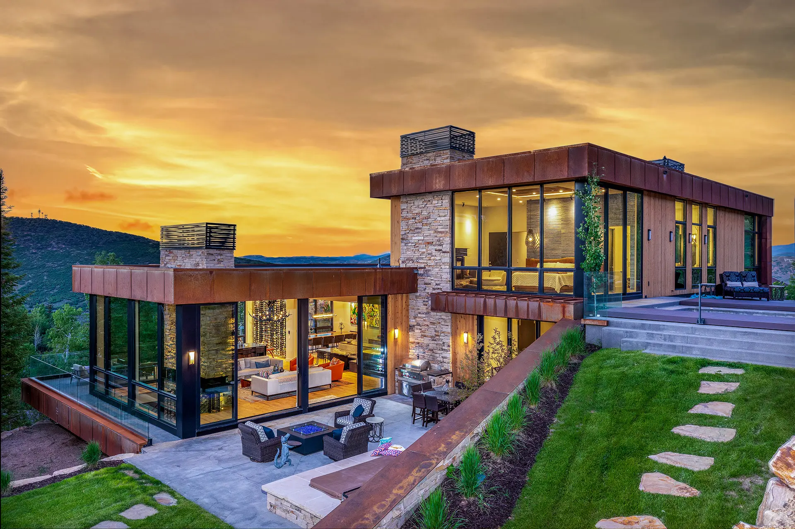

# Project Blueprint: Woodland Premium Real Estate

This document provides a comprehensive, one-shot prompt and blueprint for recreating the **Woodland Premium Real Estate** website. It is designed for high-end coding agents to implement the entire project from scratch with perfect parity in aesthetics, animations, and functionality.

---

## 1. Project Vision & Aesthetic
**Style**: "Quiet Luxury" / Minimalist Premium.
**Color Palette**: 
- Background: `#080804` (Luxurious yellowish-black).
- Accent: `#f5c518` (Signature Gold/Yellow).
- Text: `#ffffff` (Primary) and `#ffffff99` (Secondary).
- Glassmorphism: Subtle background blurs with faint white borders.

**Typography**:
- **Heading**: 'Syne' (800 weight, uppercase, tracked out).
- **Body**: 'Plus Jakarta Sans' (Minimalist, clean).

---

## 2. Technical Stack
- **Bundler**: Vite (latest).
- **Smooth Scroll**: Lenis.
- **Animations**: GSAP with ScrollTrigger.
- **Styling**: Vanilla CSS with modern Flexbox/Grid.

---

## 3. Section Breakdown

### A. Navigation
- **Sticky Blur**: Floating navbar with glassmorphism on scroll (optional) or fixed.
- **Logo**: Uppercase 'WOODLAND' with 3px letter spacing.
- **CTA**: Rounded border button "CHOOSE PROJECT" that triggers the modal.

### B. Cinematic Hero
- **Entrance**: Scale-down effect on the background image while text fades in.
- **Tagline**: Split-text effect ("We don't build houses," / "we build a better life.") using GSAP.
- **Filter Bar**: A complex, glassmorphic UI bar with 5 categories (Price, Area, Bedrooms, Floors, Type) using custom selects.

### C. Project Showcase
- **Layout**: 2-column grid with deep guttering (4rem).
- **Cards**: Sharp corners, aspect-ratio 1.6/1.
- **Animation**: Parallax image shift (image moves opposite to scroll) and fade-in entrance for lower cards.

### D. Project Selection Modal (The Masterpiece)
- **Logic**: A full-screen overlay that slides in from the right.
- **Split Screen**:
    - **Left**: Dynamic image preview that crossfades based on hover.
    - **Right**: A list of project titles with numbers (01, 02...). 
- **Interactions**:
    - Hovering a nav item updates the left visual.
    - Background scroll is locked while the modal is open.
    - Uniform exit animation (entire container slides out).

---

## 4. Complete Implementation Code

### [index.html]
```html
<!DOCTYPE html>
<html lang="en">
<head>
    <meta charset="UTF-8">
    <meta name="viewport" content="width=device-width, initial-scale=1.0">
    <title>Woodland | Premium Real Estate</title>
    <link rel="stylesheet" href="style.css">
</head>
<body>
    <div id="smooth-wrapper">
        <div id="smooth-content">
            
            <nav class="nav">
                <div class="container">
                    <div class="logo">Woodland</div>
                    <ul class="nav-links">
                        <li><a href="#" class="nav-link">About</a></li>
                        <li><a href="#" class="nav-link">Projects</a></li>
                        <li><a href="#" class="nav-link">Blog</a></li>
                        <li><a href="#" class="nav-link">Contacts</a></li>
                    </ul>
                    <button class="nav-cta">Choose Project</button>
                </div>
            </nav>

            <header class="hero">
                <div class="hero-bg">
                    
                </div>
                <div class="hero-overlay"></div>

                <div class="hero-content-wrapper">
                    <div class="hero-text-content">
                        <h1 class="tagline">
                            <span class="line"><span>We don't build houses,</span></span>
                            <span class="line"><span>we build a better life.</span></span>
                        </h1>
                    </div>

                    <div class="category-tabs">
                        <a href="#" class="tab active">All</a>
                        <a href="#" class="tab">Houses</a>
                        <a href="#" class="tab">Saunas</a>
                    </div>

                    <div class="filter-bar glass">
                        <div class="filter-item">
                            <span class="filter-label">Price</span>
                            <div class="filter-input">
                                <select>
                                    <option>$500k - $1M</option>
                                    <option>$1M - $5M</option>
                                    <option>$5M+</option>
                                </select>
                            </div>
                        </div>
                        <div class="filter-item">
                            <span class="filter-label">Area</span>
                            <div class="filter-input">
                                <select>
                                    <option>200 - 500 m²</option>
                                    <option>500 - 1000 m²</option>
                                    <option>1000m²+</option>
                                </select>
                            </div>
                        </div>
                        <div class="filter-item">
                            <span class="filter-label">Bedrooms</span>
                            <div class="filter-input">
                                <select>
                                    <option>2</option>
                                    <option>3</option>
                                    <option>4+</option>
                                </select>
                            </div>
                        </div>
                        <div class="filter-item">
                            <span class="filter-label">Floors</span>
                            <div class="filter-input">
                                <select>
                                    <option>1</option>
                                    <option>2</option>
                                    <option>3</option>
                                </select>
                            </div>
                        </div>
                        <div class="filter-item">
                            <span class="filter-label">Type</span>
                            <div class="filter-input">
                                <select>
                                    <option>Banyas</option>
                                    <option>Cottage</option>
                                    <option>Villa</option>
                                </select>
                            </div>
                        </div>
                    </div>
                </div>
            </header>

            <section class="showcase">
                <div class="container">
                    <div class="cards-grid">
                        <div class="card">
                            <div class="card-img">
                                
                            </div>
                            <div class="card-content">
                                <h3 class="card-title">Albatross</h3>
                                <div class="card-info">
                                    <span>240 m²</span>
                                    <span>3 Rooms</span>
                                    <span>2 Floors</span>
                                </div>
                            </div>
                        </div>
                        <div class="card">
                            <div class="card-img">
                                
                            </div>
                            <div class="card-content">
                                <h3 class="card-title">Zenith Estate</h3>
                                <div class="card-info">
                                    <span>380 m²</span>
                                    <span>5 Rooms</span>
                                    <span>3 Floors</span>
                                </div>
                            </div>
                        </div>
                        <!-- More cards... -->
                    </div>
                </div>
            </section>

        </div>
    </div>

    <!-- PROJECT MODAL -->
    <div class="project-modal">
        <div class="modal-content">
            <div class="modal-nav-bar">
                <div class="modal-logo">Woodland</div>
                <!-- Nav Links ... -->
                <button class="close-modal"><svg ...></svg></button>
            </div>

            <div class="modal-left">
                <div class="modal-visual-bg">
                    
                </div>
                <div class="modal-main-text">
                    <h2 class="modal-title">Elevate Your Vision</h2>
                    <p class="modal-subtitle">Architecture that speaks for itself.</p>
                </div>
            </div>

            <div class="modal-right">
                <div class="modal-nav-list">
                    <!-- Project Nav Items ... -->
                </div>
            </div>
        </div>
    </div>

    <script type="module" src="main.js"></script>
</body>
</html>
```

### [style.css]
```css
@import url('https://fonts.googleapis.com/css2?family=Plus+Jakarta+Sans:wght@300;400;500;600;700&family=Syne:wght@400;500;600;700;800&display=swap');

:root {
  --bg-color: #080804;
  --accent: #f5c518;
  --text-primary: #ffffff;
  --font-heading: 'Syne', sans-serif;
  --font-body: 'Plus Jakarta Sans', sans-serif;
  --transition-smooth: all 0.6s cubic-bezier(0.16, 1, 0.3, 1);
}

* { margin:0; padding:0; box-sizing:border-box; }
body { background: var(--bg-color); color: var(--text-primary); font-family: var(--font-body); overflow-x: hidden; }

/* Hero & Glassmorphism */
.hero { position: relative; min-height: 100vh; display: flex; flex-direction: column; justify-content: flex-end; align-items: center; padding-bottom: 16rem; }
.hero-bg { position: absolute; top:0; left:0; width:100%; height:100%; z-index:-1; overflow:hidden; }
.hero-bg img { width:100%; height:100%; object-fit:cover; filter: brightness(0.6); }

.glass {
  background: transparent;
  backdrop-filter: blur(3px);
  border: 1px solid rgba(255, 255, 255, 0.03);
}

.filter-bar { display: grid; grid-template-columns: repeat(5, 1fr); gap: 2rem; padding: 1.6rem 2.8rem; width: 100%; max-width: 1100px; border-radius: 20px; }

/* Cards & Parallax */
.cards-grid { display: grid; grid-template-columns: repeat(2, 1fr); gap: 4rem; }
.card { position: relative; aspect-ratio: 1.6/1; overflow: hidden; cursor: pointer; }
.card-img img { width:100%; height:100%; object-fit:cover; transform: scale(1.5); }
.card-content { position: absolute; inset:0; display:flex; flex-direction:column; justify-content:center; align-items:center; background:rgba(0,0,0,0.3); }

/* Project Modal */
.project-modal { position: fixed; inset:0; z-index: 1000; visibility: hidden; transform: translateX(100%); background: #080804; }
.modal-content { display: flex; height: 100%; }
.modal-left { flex: 1; position: relative; display: flex; align-items:center; padding: 4rem 8rem; padding-top: 100px; }
.modal-right { width: 450px; border-left: 1px solid rgba(255,255,255,0.05); padding-top: 100px; display:flex; flex-direction:column; }
.modal-nav-item { padding: 2.5rem 3rem; opacity: 0.6; transform: translateX(30px); transition: var(--transition-smooth); }
.modal-nav-item.active { opacity: 1; background: rgba(255,255,255,0.02); }
```

### [main.js]
```javascript
import gsap from 'gsap';
import { ScrollTrigger } from 'gsap/ScrollTrigger';
import Lenis from 'lenis';

gsap.registerPlugin(ScrollTrigger);

const init = () => {
    // 1. Smooth Scroll Init
    const lenis = new Lenis({ duration: 1.5 });
    lenis.on('scroll', ScrollTrigger.update);
    gsap.ticker.add((time) => lenis.raf(time * 1000));

    // 2. Hero Entrance Animation
    const tl = gsap.timeline({ defaults: { ease: 'power4.out', duration: 1.5 }});
    tl.to('.hero-bg img', { scale: 1, duration: 2.5 }, 0)
      .to('.tagline .line span', { y: 0, opacity: 1, stagger: 0.15 }, 0.7);

    // 3. Scroll-Triggered Parallax for Cards
    document.querySelectorAll('.card').forEach(card => {
        const img = card.querySelector('img');
        gsap.fromTo(img, { yPercent: 35 }, {
            yPercent: -35,
            scrollTrigger: { trigger: card, scrub: true }
        });
    });

    // 4. Modal Interactions
    const modalTl = gsap.timeline({ paused: true });
    modalTl.to('.project-modal', { x: '0%', visibility: 'visible', duration: 1.2, ease: 'power4.inOut' })
           .to('.modal-nav-item', { x: 0, opacity: 1, stagger:0.1, duration: 1, ease: 'power3.out' }, '-=0.5');

    const openModal = () => { lenis.stop(); modalTl.play(); };
    const closeModal = () => { 
        lenis.start(); 
        gsap.to('.project-modal', { x: '100%', duration: 0.8, ease: 'power4.in', onComplete: () => {
            gsap.set('.project-modal', { visibility: 'hidden' });
            modalTl.pause(0);
        }}); 
    };

    document.querySelector('.nav-cta').onclick = openModal;
    document.querySelector('.close-modal').onclick = closeModal;

    // 5. Hover Crossfade in Modal
    document.querySelectorAll('.modal-nav-item').forEach(item => {
        item.onmouseenter = () => {
            const imgTarget = document.querySelector('#modal-main-img');
            const newSrc = item.dataset.img;
            gsap.to(imgTarget, { opacity: 0, duration: 0.3, onComplete: () => {
                imgTarget.src = newSrc;
                gsap.to(imgTarget, { opacity: 1, duration: 0.6 });
            }});
        };
    });
};

window.onload = init;
```

---

## 6. Pro-Tips for Perfect Execution
- **GSAP Scrub**: Ensure `scrub: true` is set for all parallax elements so the motion follows the user's scroll position precisely.
- **Lenis Duration**: A duration of `1.5` or `2` provides that sluggish, high-end weight to the scrolling.
- **Z-Index Layering**: Keep the `project-modal` at `1000+` to ensure it covers everything, including the sticky nav.
- **Typography Rendering**: Use `-webkit-font-smoothing: antialiased` for ultra-crisp white text on dark backgrounds.

**This blueprint serves as a complete "One-Shot" manual for the Woodland Premium Property Portal.**
